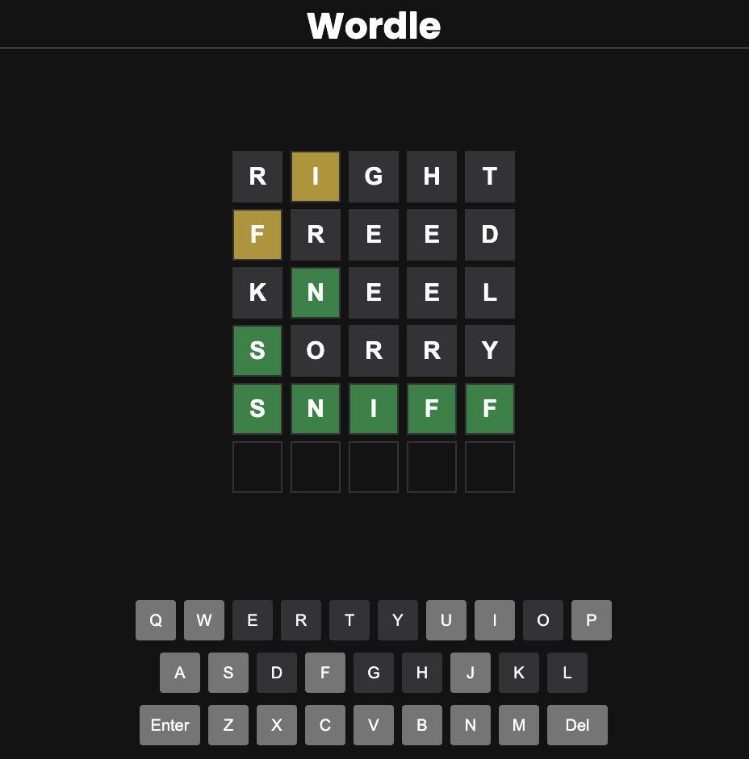

# Getting Started with Wordle Clone App

A simple clone of infamous wordle game. Built using React and Context API. Also you don't have to wait hours to play new game, you can play as many games you want. You get 6 attempts to guess 5 letter word.

## Available Scripts

In the project directory, you can run:

### `npm install`

Installs the depedencies inorder to run the app.

### `npm start`

Runs the app in the development mode.\
Open [http://localhost:3000](http://localhost:3000) to view it in the browser.

The page will reload if you make edits.\
You will also see any lint errors in the console.
